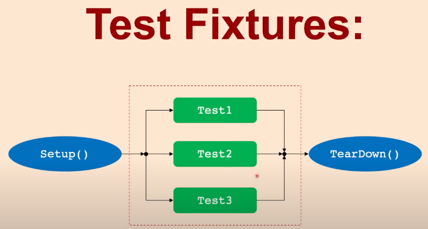

# What is the test fixture?
- The test fixture helps organize the common facilities needed by all the tests in one place.

- Once we define a text fixture, `Setup` function will be executed first, then `test1`, then `TearDown`.
- Then for `test2`, the `Setup` will be executed, then `test2` then `TearDown` and similarly for `test3`.

Test Fixture


# How to achieve test fixture in google test?

- First we define a class, then inherit from the googletest `::testing::Test`
```cpp
    class myTextFixture : public ::testing::Test{
        protected:

        void SetUp() override
        {
            ...
        }
        void TearDown() override
        {
            ...
        }

    };
``` 

- Second, use the `TEST_F()` macro with the first param is the same name with the class
```cpp
    TEST_F(myTextFixture, test1){
        ...
    }
```

# How to run
```bash
    . ./project_setup.sh
    cmake ..
    make -j4
    ctest
```

# How to clean
```bash
    ./project_clean.sh
```

# Notes
- The Four-Phases test pattern:
    - `Setup`: Establish the precondition to test
    - `Exercise`: Do something to the system
    - `Verify`: Check the expected outcome
    - `Cleanup`: Return the system under test to its initial state after the test.
