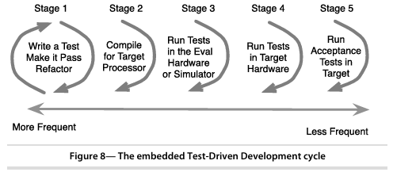
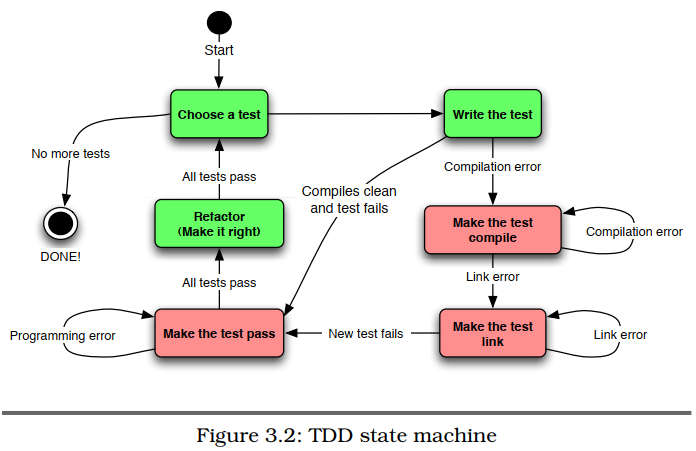

# What is the Test-Driven Development?
- Test-Driven Development (TDD) is a software development approach in which tests are written before the code that needs to be tested. The core principles of TDD can be summarized as follows:
    - `Write a Test`: Before writing any production code, developers write a test for the new functionality they want to implement. This test is often based on a requirement or a user story.
    - `Run the Test`: The newly written test will fail because the functionality it is testing does not yet exist. This failure confirms that the test is valid and that the desired feature has not yet been implemented.
    - `Write the Code`: Developers then write the minimum amount of code necessary to make the test pass. The goal is to implement just enough functionality to satisfy the test criteria.
    - `Run the Tests Again`: After writing the code, the developer runs all tests (including the new one) to ensure that everything works as expected. At this point, the new test should pass.
    - `Refactor the Code`: Once the test passes, the developer may refactor the code to improve its structure or efficiency while ensuring that all tests continue to pass. Refactoring helps maintain code quality and readability.
    - `Repeat`: The cycle is repeated for each new piece of functionality. New tests are added, existing tests are run, code is written, and refactoring occurs continuously.

The TDD Cycle



# The TDD State Machine


# How testability impacts design 
- In creating a modular in C, we will draw upon the idea of an `Abstract Data Type`. 
- In an ADT, a module's data is treated as private; it is encapsulated.
- There are a couple modularity options we can employ for encapsulating a module's data.
    - `The first choice` is to hide the data using static file scope variables in the .c file, giving access to the functions in the compilation unit.
    - The data is accessible only indirectly through the module's public interface, which defined in the .h file as a set of function prototypes.
    - This approach works for a module that has a single set of data to manage, it may be called `single instance module`
    ```c
    // counter.h
    #ifndef COUNTER_H
    #define COUNTER_H

    // initialize the counter
    void counter_init(void);

    // increase the counter value
    void counter_increment(void);

    // get counter value
    int counter_get_value(void);

    #endif // COUNTER_H
    ```
    ```c
    // counter.c
    #include "counter.h"

    // The private data that can only be access indirect through counter.c
    static int counter_value = 0;

    // defination of the init counter
    void counter_init(void) {
        counter_value = 0; // init the start counter value
    }

    // defination of the increase counter value
    void counter_increment(void) {
        counter_value++;
    }

    // defination of the get counter value
    int counter_get_value(void) {
        return counter_value; // return the counter value
    }
    ```
    ```c
    // main.c
    #include <stdio.h>
    #include "counter.h"

    int main() {
        counter_init(); // init the counter

        counter_increment(); // increase the counter
        counter_increment(); // increase the counter

        int value = counter_get_value(); // get counter value
        printf("Current counter value: %d\n", value); // print out the counter value

        return 0;
    }
    ```

    - `The second choice`, When a module has to manage different sets of data for different clients, we can use the `multiple-instance module`.
    - Structures must be initialized and passed back to a client holding their context. We can declare a `typedef` of a forward declared struct in the header file like this:
    ```c
        typedef struct CircularBufferStruct * CircularBuffer;
    ``` 
    - The compiler is allow the pointer to incomplete types to be passed around as long as no code dereferences the pointer.

    ```c
    // CircularBuffer.h
    #ifndef CIRCULAR_BUFFER_H
    #define CIRCULAR_BUFFER_H

    // Forward declaration of the incomplete structure
    typedef struct CircularBufferStruct *CircularBuffer;

    // Function to create a circular buffer
    CircularBuffer circular_buffer_create(size_t size);

    // Function to add an element to the circular buffer
    void circular_buffer_add(CircularBuffer buffer, int value);

    // Function to get an element from the circular buffer
    int circular_buffer_get(CircularBuffer buffer);

    // Function to free the circular buffer
    void circular_buffer_destroy(CircularBuffer buffer);

    #endif // CIRCULAR_BUFFER_H
    ```
    ```c
    // CircularBuffer.c
    #include <stdlib.h>
    #include "circular_buffer.h"

    // Definition of the CircularBufferStruct
    struct CircularBufferStruct {
        int *buffer;          // Array to store data
        size_t head;         // Position for the next write
        size_t tail;         // Position for the next read
        size_t max_size;     // Maximum size of the buffer
    };

    // Function to create a circular buffer
    CircularBuffer circular_buffer_create(size_t size) {
        CircularBuffer cb = (CircularBuffer)malloc(sizeof(struct CircularBufferStruct));
        cb->buffer = (int *)malloc(size * sizeof(int)); // Allocate memory for the data array
        cb->head = 0;  // Initialize head to 0
        cb->tail = 0;  // Initialize tail to 0
        cb->max_size = size; // Set maximum size
        return cb; // Return the created buffer
    }

    // Function to add an element to the circular buffer
    void circular_buffer_add(CircularBuffer buffer, int value) {
        buffer->buffer[buffer->head] = value; // Store the value at the head position
        buffer->head = (buffer->head + 1) % buffer->max_size; // Move head forward, wrap around if needed
    }

    // Function to get an element from the circular buffer
    int circular_buffer_get(CircularBuffer buffer) {
        int value = buffer->buffer[buffer->tail]; // Get the value at the tail position
        buffer->tail = (buffer->tail + 1) % buffer->max_size; // Move tail forward, wrap around if needed
        return value; // Return the value
    }

    // Function to free the circular buffer
    void circular_buffer_destroy(CircularBuffer buffer) {
        free(buffer->buffer); // Free the data array
        free(buffer); // Free the CircularBuffer structure
    }
    ```
    ```c
    // main.c
    #include <stdio.h>
    #include "circular_buffer.h"

    int main() {
        // Create a circular buffer with a size of 5
        CircularBuffer myBuffer = circular_buffer_create(5);

        // Add some elements to the buffer
        for (int i = 0; i < 5; i++) {
            circular_buffer_add(myBuffer, i);
        }

        // Retrieve and print elements from the buffer
        for (int i = 0; i < 5; i++) {
            printf("Value: %d\n", circular_buffer_get(myBuffer));
        }

        // Free the circular buffer
        circular_buffer_destroy(myBuffer);
        return 0;
    }

    ```

# How to use TDD to design modular C
- `The header file` defines the module's interface.
    - For `single instance modules`, the header file is made up of function prototypes.
    - For `multi instance modules (ADT)`, in addition to function prototypes, a typedef is created for a pointer to a forward declared struct. Hiding the struct hides the data details of the module.
- `The source file` contains the implementation of the interface. It also includes any needed private helper functions and hidden data.
    - The module implementation manages the integrity of the module's data.
    - `For ADTs`, the forward declared struct members are defined in the source file.
- `The test file` holds the test cases, keeping test code and production code seperate.
    - Each module has at least one test file usually containing only one, but sometime few, test fixture.
    - When the setup needs of some test cases are significantly different from other, we'll use multiple test groups and maybe multiple test files.
- `Module initialization and cleanup functions`. Every module that manages hidden data should have initialization and cleanup functions.  
    - `Open()` and `Close()` is a example

# How to run
```bash
    . ./project_setup.sh
    cmake ..
    make -j4
    ctest
```

# How to clean
```bash
    ./project_clean.sh
```

# Notes
- The Four-Phases test pattern:
    - `Setup`: Establish the precondition to test
    - `Exercise`: Do something to the system
    - `Verify`: Check the expected outcome
    - `Cleanup`: Return the system under test to its initial state after the test.
