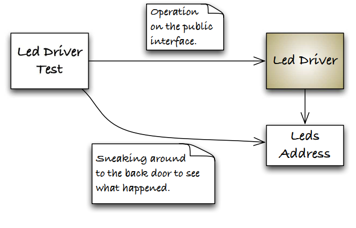
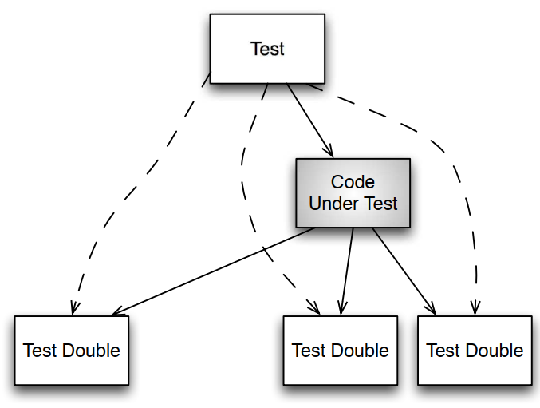

# The Target Hardware Bottleneck
- The question with those previous demos is that, are the tests valid when they are not run on the target hardrware?
- The answer is, they are valuable, but along with the benefits, there are risks that must be considered and contained.
- Problem with Target Hardware:
    - Target hardware is expensive and scarce. This makes developers
wait and build up mounds of unverified work.
    - When target hardware is finally available, it may have bugs of its
own. The mound of untested software has bugs too. Putting them
together makes for difficult debugging, long days, and plenty of
finger pointing.
- Embedded developers have traditionally turned to the evaluation board
for relief from one of the causes of the target hardware bottleneck.
- An eval board is a circuit board used in development with the same processor configuration as the target system and ideally some of the same I/O.

# The Embedded TDD Cycle


- The TDD microcycle is the `first stage` of the embedded TDD cycle.
- `Stages 2–4` are designed to mitigate the risk of using the development
platform to run unit tests. 
- `Stage 5` makes sure that the fully integrated
system delivers working features.

- `Stage 1 - TDD Cycle`:
    - During this stage, you write the bulk of the code and compile it
to run on your host development system (VSCode).
    - Testing it on the development system gives fast feedback, not encumbered by the constraints of hardware reliability or availability. 
    - During this stage, you write code that is platform independent.
You look for opportunities to disconnect software from hardware, as much as is practical.
- `Stage 2 — Compiler Compatibility Check`:
    - compile for the target, using the cross-compiler (gnu-tool chain) you
expect to use for production compilations.
    - This stage warns of porting problems such as unavailable header files, incompatible language support, and missing language features. 
    - Take your best guess about the tool chain, and compile against
that compiler. You could use your suite of tests as part of your
compiler evaluation criteria. As the compiler market changes, you
also could use your suite of tests to evaluate new compiler vendors
or versions.
- `Stage 3—Run Unit Tests in an Eval Board`:
    - There is a risk that the compiled code will run differently in the
host development system and the target processor.
    - To mitigate this risk, run the unit tests on an eval board.
    - In an ideal world, we’d have the target hardware, and we would
not need to use eval hardware. `But don’t make this decision lightly.`
- `Stage 4—Run Unit Tests in the Target Hardware`:
    - The objectives here are the same as stage 3 while exercising the
real hardware. One additional aspect to this stage is that you
could also run target hardware-specific tests.
    - An additional `challenge` in this stage is `limited memory in the target`. You might find that all the tests do not fit into the target.
    - In that case, you can organize the tests into separate test suites
where each suite fits in memory.
- `Stage 5—Run Acceptance Tests in the Target`:
    - Finally, we make sure the product features work by running automated and manual acceptance tests in the target.
    - Here you have to make sure that any of the hardware-dependent code that can’t be fully tested automatically is tested manually.

# Stage2 Problem:
## Incompatible Header Files
- An example of this kind of incompatibility is the safer versions of sprintf().
    - In the Unix world, there is snprintf( ), and in the Windows world there is _snprintf( ), two functions that do almost the same thing.
- Many C programmers use conditional compilation to handle platformspecific code. I suggest you avoid conditional compilation because it
makes a mess of the code.

# Test Doubles
## Collaborators
- A Collaborators is some function, data, module, or device outside the code under test (CUT) that the CUT depends upon.
- A test double impersonate some function, data, module, or library during a test. The cut does not know it is using the double; it interacts with 
the double the same way it interacts with the real Collaborators.



## Breaking Dependencies
- Code has dependencies. One module interacts with several others to get its job done.
- The key to breaking the dependencies is a more rigorous use of interfaces, encapsulation.
- To design more modular and testable C, we employ a header file to publish the interface of the module.

- Without the test doubles, we have the dependency mess.


- How we can use the test doubles to simplify testing and reduce knowledge of transitively depended on 
components.
- The test doubles are not full simulations of the thing being replaced
- Test doubles provide indirect inputs (return values) to the CUT or to
capture and possibly check indirect outputs (parameters) sent by the
CUT to the test double.



## When to use the Test Doubles
- Here are some common reasons to use a test double:
- `Hardware independence`:
    - Having test doubles for hardrware interactions will allow testing independently from the hardrware
    - It also provides the ability to feed a wide variety of inputs into the core of the system that may 
    be very difficult or time-consuming to do in the lab or field.
- `Inject difficult to produce input(s)`:
    - Some computed or hardware-generated event scenerios may be difficult to produce.
    - By adjusting the return result of a test double, the CUT might have all it needs to trigger some 
    unlikely execution path.
- `Speed up a slow collaborator`:
    - A slow collaborator, such as a database, a network service, or some number crunching, 
    can be faked out by returning a result controlled by the test case, speeding up the test.
- `Dependency on something volatile`:
    - The classic example of a volatile collaborator is the clock.
    - Example we want some event that is supposed to happen at 8:42pm. Either we have one chance or
    we have to reset the clock.
    - But with the double standing in for the clock, it can be 8:42pm - or the last day of leap year - 
    whenever we want.
- `Dependency on something under development`:
    - Example when the software and hardware are concurrently developed.
- `Dependency on something that is difficult to configure`:
    - A database is a good example of a DOC that you could test with but is difficult to set up.

## Test Doubles Variations

| Name | Variation |
|:-----:|:-------:|
|Test Dummy| Keeps the linker from rejecting your build. A dummy is a simple stub that is never called. It is provided to satisfy the compiler, linker or runtime dependency|
|Test Stub | Return some value, as directed by the current test case|
|Test Spy | Capture the params passed from the CUT, so the test can verify that correct params have been passed to the CUT. The spy can also feed return values to the CUT just like the test stub|
|Mock Object| - Verifies the functions called, the call order, and the params passed from the CUT to the DOC. It also is programmed to return specific values to the CUT.<br>- The mock object is usually dealing with a situation where multiple calls are made to it, and it call and response are potenially different|
|Fake Object| - Provides a partial implementation for the replaced components<br>- The fake usually has a simplified implementation when compared to the replaced implementation.|
| Exploring fake| Causes the test to fail if it is called.|

## How can we substituting the test double for the production code.
- C has only three primitive mechanisms: 
    - `Linker substitution`: 
        - Use link-time substitution when we want to replace the DOC for the `whole unit test executable`.
        - Also, we will need to use linker substitute a module where you do not control the interface. 
    - `Function Pointer substitution`:
        - Use function pointer substitution when we want to replace the DOC for only some of the test cases.
        - Function pointer allow greate control over which functions get overridden and which do not.
    - `Preprocessor substitution`:
        - Use preprocessor substitution when linker and function pointer substitution can't do the job.
        - We can `break the chain` of unwanted includes with the preprocessor
    - `Combined link-time and function pointer substitution`:
        - A link-time stub can be created that contains a function pointer. 
        - Initially the function pointer is initialized to NULL.
In this case, the stub has default do-nothing behavior. A test case
can override the NULL pointer and provide exactly the stub function
needed for the test.
        


# How to run
```bash
    . ./project_setup.sh
    cmake ..
    make -j4
    ctest
```

# How to clean
```bash
    ./project_clean.sh
```

# Notes
- The Four-Phases test pattern:
    - `Setup`: Establish the precondition to test
    - `Exercise`: Do something to the system
    - `Verify`: Check the expected outcome
    - `Cleanup`: Return the system under test to its initial state after the test.
