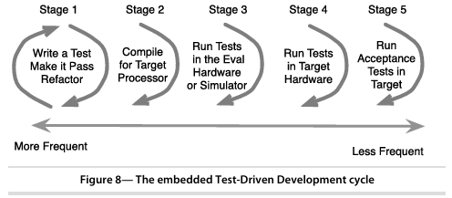

# The Target Hardware Bottleneck
- The question with those previous demos is that, are the tests valid when they are not run on the target hardrware?
- The answer is, they are valuable, but along with the benefits, there are risks that must be considered and contained.
- Problem with Target Hardware:
    - Target hardware is expensive and scarce. This makes developers
wait and build up mounds of unverified work.
    - When target hardware is finally available, it may have bugs of its
own. The mound of untested software has bugs too. Putting them
together makes for difficult debugging, long days, and plenty of
finger pointing.
- Embedded developers have traditionally turned to the evaluation board
for relief from one of the causes of the target hardware bottleneck.
- An eval board is a circuit board used in development with the same processor configuration as the target system and ideally some of the same I/O.

# The Embedded TDD Cycle


- The TDD microcycle is the `first stage` of the embedded TDD cycle.
- `Stages 2–4` are designed to mitigate the risk of using the development
platform to run unit tests. 
- `Stage 5` makes sure that the fully integrated
system delivers working features.

- `Stage 1 - TDD Cycle`:
    - During this stage, you write the bulk of the code and compile it
to run on your host development system (VSCode).
    - Testing it on the development system gives fast feedback, not encumbered by the constraints of hardware reliability or availability. 
    - During this stage, you write code that is platform independent.
You look for opportunities to disconnect software from hardware, as much as is practical.
- `Stage 2 — Compiler Compatibility Check`:
    - compile for the target, using the cross-compiler (gnu-tool chain) you
expect to use for production compilations.
    - This stage warns of porting problems such as unavailable header files, incompatible language support, and missing language features. 
    - Take your best guess about the tool chain, and compile against
that compiler. You could use your suite of tests as part of your
compiler evaluation criteria. As the compiler market changes, you
also could use your suite of tests to evaluate new compiler vendors
or versions.
- `Stage 3—Run Unit Tests in an Eval Board`:
    - There is a risk that the compiled code will run differently in the
host development system and the target processor.
    - To mitigate this risk, run the unit tests on an eval board.
    - In an ideal world, we’d have the target hardware, and we would
not need to use eval hardware. `But don’t make this decision lightly.`
- `Stage 4—Run Unit Tests in the Target Hardware`:
    - The objectives here are the same as stage 3 while exercising the
real hardware. One additional aspect to this stage is that you
could also run target hardware-specific tests.
    - An additional `challenge` in this stage is `limited memory in the target`. You might find that all the tests do not fit into the target.
    - In that case, you can organize the tests into separate test suites
where each suite fits in memory.
- `Stage 5—Run Acceptance Tests in the Target`:
    - Finally, we make sure the product features work by running automated and manual acceptance tests in the target.
    - Here you have to make sure that any of the hardware-dependent code that can’t be fully tested automatically is tested manually.

# Stage2 Problem:
## Incompatible Header Files
- An example of this kind of incompatibility is the safer versions of sprintf().
    - In the Unix world, there is snprintf( ), and in the Windows world there is _snprintf( ), two functions that do almost the same thing.
- Many C programmers use conditional compilation to handle platformspecific code. I suggest you avoid conditional compilation because it
makes a mess of the code. 
# How to run
```bash
    . ./project_setup.sh
    cmake ..
    make -j4
    ctest
```

# How to clean
```bash
    ./project_clean.sh
```

# Notes
- The Four-Phases test pattern:
    - `Setup`: Establish the precondition to test
    - `Exercise`: Do something to the system
    - `Verify`: Check the expected outcome
    - `Cleanup`: Return the system under test to its initial state after the test.
